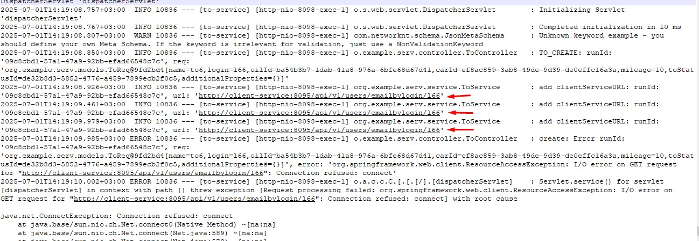

# Проектная работа (Сервис Тех обслуживания)

### Описание:
Проект состоит из 4 сервисов:
* Client (Клиенты и их email)
* Oil (Масла + справочники: Типы масел и вязкости)
* Car (Машины + справочники: Марка/модель и типы моторов)
* Serv (Сервис тех обслуживания)

Каждый из сервисов имеет собственную БД (clientdb, oildb, cardb, servdb). Создание таблиц и добавление данных (справочников) осуществляется при помощи liquibase. Первоначально нужно создать бд.
У каждого сервиса есть Swagger: http://127.0.0.1:8095/swagger-ui/index.html
порты (Client 8095, Oil 8096, Car 8097, Serv 8098)

Для основной сущьности сервиса (в каждом) производиться валидация в соответствии со схемой JSON.
Написаны тесты позволяющие проверить основной функционал.

Client

Oil

Car

Serv

Сборка проекта осуществляется командой mvn clean package -DskipTests каждого сервиса отдельно.
Все приложения запакованы в docker image и поднимаются при помощи compose.

Для защиты от перегрузки в сервисе oil( добавление записи) добавлено ограничение не более 20 запросов в секунду 
и не более 200 в минуту + проверка (метод не выполняется, если 50% запросов за последние 10 секунд были не успешные).

* Созданы 3 jmx (20rps, 21rps, и 1rps) для проверки.

### Запуск с использованием jmeter (Файл приложен в папке res):
* Запрос на добавления записи

* 21rps

* Видно что на 21 сработало ограничение (метод не позволяет выполнить более 20 запросов в секунду)

* 20rps

* Успешный ответ 

* Метрики собираются в prometheus (он доступен на порту 9090)

* Отображение данных grafana (порт 3000). В правом верхнем углу видно 4 (OK) показывающий что метрики собираются со всех 4 сервисов.

* Latency в 95р (На сервис подавалась сначала нагрузка в 25rps, после остановки значение изменил на 2 rps)

* В сервисе serv(to) в основном методе  добавления записи добален повторный вызов при не удаче

Видна его работа (делает 3 попытки). Сейчас сервис client остановлен

Если все сервисы запущены то вызов проходит с первого раза.

*  В методе сервиса car-service получения машины по regNumber добавлен кеш. (Сразу виден прирост в скорости ответа.)

* Вызов метода (происходит обращение к бд)

* Повторный вызов (данные отдаются из кеша)

* Scheduled в сервисе to(serv). С периодичностью в одну минуту выбираются записи
  actual = true и ((dateTo =null и Status ="Не требуется ТО" и пробег менее 10001)
или dateTo меньше на 5 минут от текущего времени и Status ="Проведено ТО"))
По выбраным ид (список) обновляется статус на "Требуется провести ТО"

* Сервис client  содержит оценку производительности алгоритмов хеша.
  В результате видно что оптимально использовать алгоритм sha256
  (Throughput -операций в секунду), на железе CPU: (i5-14600K), RAM: (32 Gb)
  

* Подписание jar (keytool & jarsigner)

  keytool -genkeypair -alias cert1 -keypass pass123 -validity 365 -storepass stpass123 -keyalg RSA -keystore .\keystore\our_keystore
  keytool -list -storepass stpass123 -keystore .\keystore\our_keystore
  jarsigner -verify .\client\target\client-0.0.1-SNAPSHOT.jar
  jarsigner .\client\target\client-0.0.1-SNAPSHOT.jar -keystore .\keystore\our_keystore cert1

Выпуск самоподписанного сертификата:

Просмотр к кейсторе:

Просмотр подписана ли jar (не подписана):

Подпись jar:

Просмотр подписана ли jar (подписана):

* VusualVM. Запускаем VisualVM --> Profile -->JDBC. Выбираем машину по номеру и видим в запросы SELECT (Invocations 1), так как у нас там использовался кеш то повторный вызов метода не производит запрос к БД. 
В запросах видно что выбирались кроме основной сущьности (car) связанные с ней motor_type и mark_model 

В ответе это тоже видно.

* В проекте были задействованы:
1)Circuitbreaker,
2)Swagger,
3)Prometheus&Grafana,
4)Docker,
5)Benchmark,
6)VisualVM,
7)Sign,
8)Jmeter,
9)SoftReference,
10)Sheduled,
11)Log,
12)Liquibase

